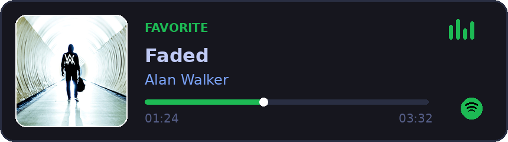

<h1 align="left">Hi, I'm unxssh 👋</h1>

> *Software Developer passionate about architecture, low-level systems, and automation.*

```bash
$ cat aboutme.json
{
  "focus": "clean code & software architecture",
  "learning": "systems design & performance optimization",
  "contact": "unxssh@gmail.com"
}
```

### 🛠️ stack

<p align="left">
  
</p>

### 🎵 favorite

<p align="left">
  <a href="https://open.spotify.com/track/7gHs73wELdeycvS48JfIos?si=f94fbbb53eb744af" target="_blank">
    
  </a>
</p>

### 📊 activity

<p align="left">
  
</p>
